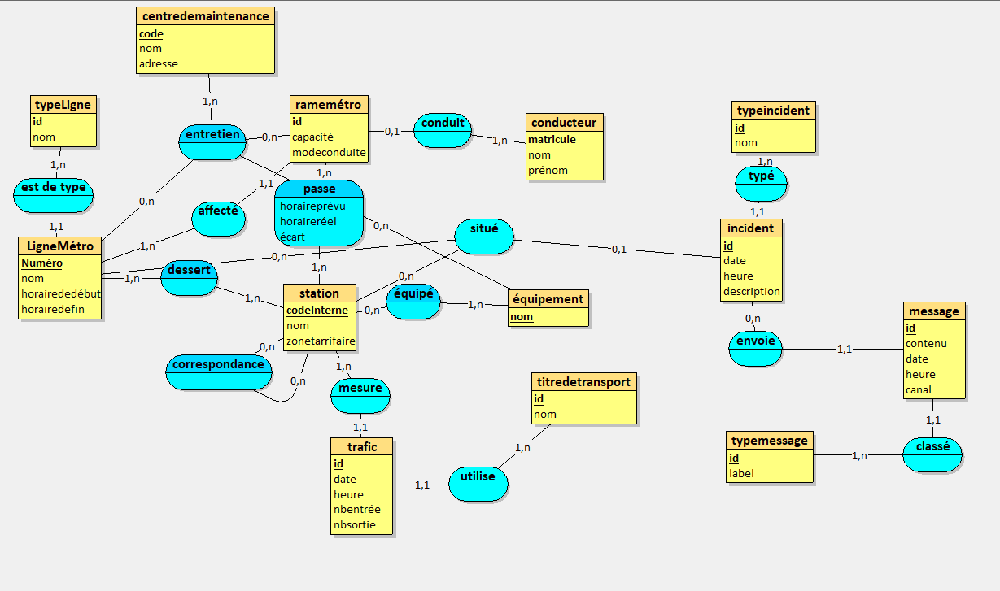

# Système d'information pour entreprise de transport urbain
**Projet de base de données - Second rendu**

*Clément Besnard & Henri Hartz*

## Rappel du MCD :

## III. Troisième étape : MLD et MPD

### A. MLD

typeLigne = (id INT, nom VARCHAR(50));  
station = (codeInterne VARCHAR(10), nom VARCHAR(60), zonetarrifaire DECIMAL(1,0));  
équipement = (nom VARCHAR(30));  
titredetransport = (id INT, nom VARCHAR(30));  
conducteur = (matricule VARCHAR(8), nom VARCHAR(30), prénom VARCHAR(30));  
typeincident = (id INT, nom VARCHAR(30));  
typemessage = (id VARCHAR(10), label VARCHAR(255));  
centredemaintenance = (code VARCHAR(10), nom VARCHAR(60), adresse VARCHAR(120));  
trafic = (id INT, date_ DATE, heure TIME, nbentrée INT, nbsortie INT, #id_1, #codeInterne);  
LigneMétro = (Numéro DECIMAL(2,0), nom VARCHAR(50), horairededébut TIME, horairedefin TIME, #id);  
ramemétro = (id DECIMAL(6,0), capacité DECIMAL(4,0), modeconduite VARCHAR(15), #matricule*, #Numéro);  
incident = (id INT, date_ DATE, heure TIME, description VARCHAR(255), #Numéro*, #codeInterne*, #id_1);  
message = (id INT, contenu VARCHAR(255), date_ DATE, heure TIME, canal VARCHAR(50), #id_1, #id_2);  
dessert = (#Numéro, #codeInterne);  
équipé = (#codeInterne, #nom);  
passe = (#codeInterne, #id, horaireprévu DATETIME, horaireréel DATETIME, écart DECIMAL(3,0));  
correspondance = (#codeInterne, #codeInterne_1);  
entretien = (#Numéro, #nom, #id, #code);  

### B. MPD

CREATE TABLE typeLigne(
   id INT,
   nom VARCHAR(50),
   PRIMARY KEY(id)
);

CREATE TABLE station(
   codeInterne VARCHAR(10),
   nom VARCHAR(60),
   zonetarrifaire DECIMAL(1,0),
   PRIMARY KEY(codeInterne)
);

CREATE TABLE équipement(
   nom VARCHAR(30),
   PRIMARY KEY(nom)
);

CREATE TABLE titredetransport(
   id INT,
   nom VARCHAR(30) NOT NULL,
   PRIMARY KEY(id)
);

CREATE TABLE conducteur(
   matricule VARCHAR(8),
   nom VARCHAR(30),
   prénom VARCHAR(30),
   PRIMARY KEY(matricule)
);

CREATE TABLE typeincident(
   id INT,
   nom VARCHAR(30) NOT NULL,
   PRIMARY KEY(id)
);

CREATE TABLE typemessage(
   id VARCHAR(10),
   label VARCHAR(255),
   PRIMARY KEY(id)
);

CREATE TABLE centredemaintenance(
   code VARCHAR(10),
   nom VARCHAR(60),
   adresse VARCHAR(120),
   PRIMARY KEY(code)
);

CREATE TABLE trafic(
   id INT,
   date_ DATE,
   heure TIME,
   nbentrée INT,
   nbsortie INT,
   id_1 INT NOT NULL,
   codeInterne VARCHAR(10) NOT NULL,
   PRIMARY KEY(id),
   FOREIGN KEY(id_1) REFERENCES titredetransport(id),
   FOREIGN KEY(codeInterne) REFERENCES station(codeInterne)
);

CREATE TABLE LigneMétro(
   Numéro DECIMAL(2,0),
   nom VARCHAR(50),
   horairededébut TIME,
   horairedefin TIME,
   id INT NOT NULL,
   PRIMARY KEY(Numéro),
   FOREIGN KEY(id) REFERENCES typeLigne(id)
);

CREATE TABLE ramemétro(
   id DECIMAL(6,0),
   capacité DECIMAL(4,0),
   modeconduite VARCHAR(15),
   matricule VARCHAR(8),
   Numéro DECIMAL(2,0) NOT NULL,
   PRIMARY KEY(id),
   FOREIGN KEY(matricule) REFERENCES conducteur(matricule),
   FOREIGN KEY(Numéro) REFERENCES LigneMétro(Numéro)
);

CREATE TABLE incident(
   id INT,
   date_ DATE,
   heure TIME,
   description VARCHAR(255),
   Numéro DECIMAL(2,0),
   codeInterne VARCHAR(10),
   id_1 INT NOT NULL,
   PRIMARY KEY(id),
   FOREIGN KEY(Numéro) REFERENCES LigneMétro(Numéro),
   FOREIGN KEY(codeInterne) REFERENCES station(codeInterne),
   FOREIGN KEY(id_1) REFERENCES typeincident(id)
);

CREATE TABLE message(
   id INT,
   contenu VARCHAR(255),
   date_ DATE,
   heure TIME,
   canal VARCHAR(50),
   id_1 INT NOT NULL,
   id_2 VARCHAR(10) NOT NULL,
   PRIMARY KEY(id),
   FOREIGN KEY(id_1) REFERENCES incident(id),
   FOREIGN KEY(id_2) REFERENCES typemessage(id)
);

CREATE TABLE dessert(
   Numéro DECIMAL(2,0),
   codeInterne VARCHAR(10),
   PRIMARY KEY(Numéro, codeInterne),
   FOREIGN KEY(Numéro) REFERENCES LigneMétro(Numéro),
   FOREIGN KEY(codeInterne) REFERENCES station(codeInterne)
);

CREATE TABLE équipé(
   codeInterne VARCHAR(10),
   nom VARCHAR(30),
   PRIMARY KEY(codeInterne, nom),
   FOREIGN KEY(codeInterne) REFERENCES station(codeInterne),
   FOREIGN KEY(nom) REFERENCES équipement(nom)
);

CREATE TABLE passe(
   codeInterne VARCHAR(10),
   id DECIMAL(6,0),
   horaireprévu DATETIME,
   horaireréel DATETIME,
   écart DECIMAL(3,0),
   PRIMARY KEY(codeInterne, id),
   FOREIGN KEY(codeInterne) REFERENCES station(codeInterne),
   FOREIGN KEY(id) REFERENCES ramemétro(id)
);

CREATE TABLE correspondance(
   codeInterne VARCHAR(10),
   codeInterne_1 VARCHAR(10),
   PRIMARY KEY(codeInterne, codeInterne_1),
   FOREIGN KEY(codeInterne) REFERENCES station(codeInterne),
   FOREIGN KEY(codeInterne_1) REFERENCES station(codeInterne)
);

CREATE TABLE entretien(
   Numéro DECIMAL(2,0),
   nom VARCHAR(30),
   id DECIMAL(6,0),
   code VARCHAR(10),
   PRIMARY KEY(Numéro, nom, id, code),
   FOREIGN KEY(Numéro) REFERENCES LigneMétro(Numéro),
   FOREIGN KEY(nom) REFERENCES équipement(nom),
   FOREIGN KEY(id) REFERENCES ramemétro(id),
   FOREIGN KEY(code) REFERENCES centredemaintenance(code)
);